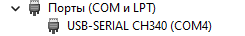
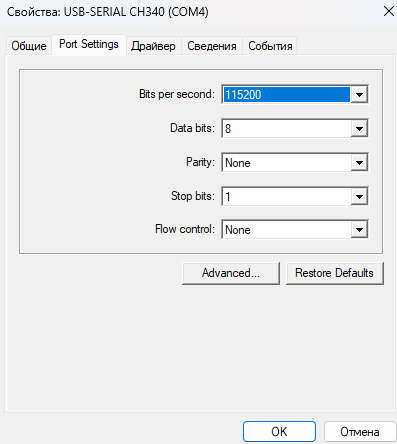
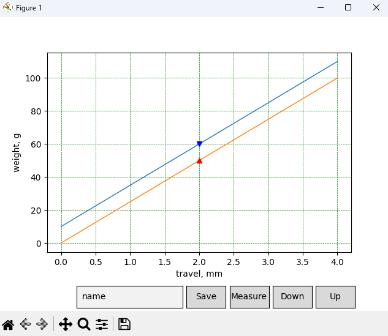
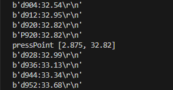
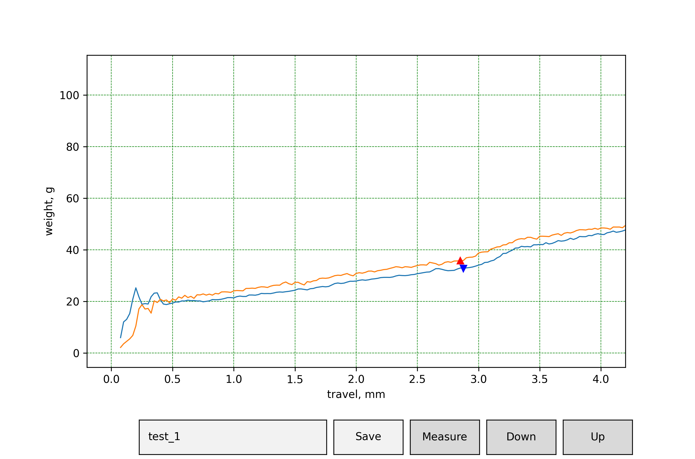
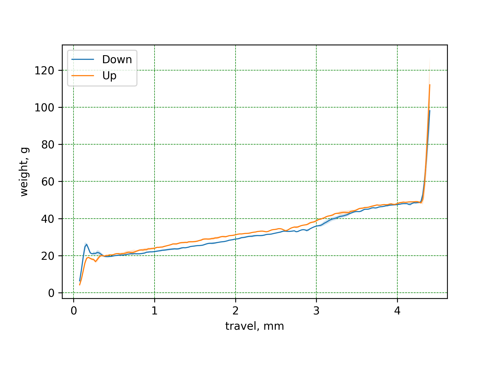
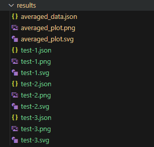

# Устройство для измерения механических переключателей

Этот проект включает код и инструкции для использования устройства, которое измеряет показатели для механических переключателей клавиатуры.
Здесь находится только код для измерений, но не сама прошивка.

> В result находятся примеры измерений

## Настройка и запуск

### 1. Настройка COM порта

В файле `switch_tester.py` необходимо указать правильный COM порт, к которому подключено устройство.

- В Windows можно узнать номер COM порта через **Диспетчер устройств** -> **Порты (COM и LTP)**.
- Обновите строку в коде:

    ```python
    ser = serial.Serial('COM4', 115200)
    ```



### 2. Установка скорости передачи данных (Bits per second)

Убедитесь, что скорость передачи данных совпадает с настройками в `switch_tester.py`. По умолчанию скорость установлена на 115200.

- Можно изменить эту настройку либо в коде, либо в настройках устройства.



### 3. Запуск программы

Запуск программы из той системы, где проверяли порт. Если Windows, то запустить в **PowerShell** или **GitBash**:

```bash
python3 .\switch_tester.py
```

После запуска программы откроется окно:



### 4. Измерение

После запуска программы, в открывшемся окне пользователь может выполнить следующие шаги:

- **Ввод имени измерения**: В поле с меткой `name` необходимо ввести название для текущего измерения. Это название будет использоваться для сохранения результатов. Например, `test_1`.
  
- **Запуск измерения**: После ввода имени, нажмите кнопку `Measure` для начала процесса измерения. Программа начнет собирать данные о характеристиках переключателя. Во время измерения в терминате будут отображаться текущие точки.

  - **Точка нажатия (Press Point)**: Точка срабатывания.
  
  - **Точка отпускания (Release Point)**: точка, в которой механизм переключателя размыкает контакт и клавиатура перестает регистрировать клавишу как нажатую.

  
  
### 5. Сохранение результатов

- **Сохранение данных**: После завершения измерения нажмите кнопку `Save`, чтобы сохранить результаты. Программа создаст файлы в папке `result`, используя имя, которое вы указали ранее (например, `test_1`).

- **Форматы файлов**: Результаты измерения сохраняются в трех форматах:
  
  - **JSON**: Файл формата `.json`, удобно для дальнейшего анализа или интеграции с другими программами.
  
  - **PNG и SVG**: `PNG` - это растровый формат, подходящий для общего использования, а `SVG` - векторный формат, удобный для масштабирования.

  

### 6. Усреднение данных (avg_data.py)

Для получения более точных результатов можно использовать скрипт `avg_data.py`. 

- **Усреднение данных**: Если в папке `result` содержится несколько измерений (например, `test_1`, `test_2` и т.д.), этот скрипт позволит объединить их и получить среднее значение.

- **Запуск скрипта**: Запустите `avg_data.py` из командной строки, он автоматически проанализирует все файлы в папке `result`, создавая усредненный график на основе всех измерений.

  


  


### Состав

- Arduino Nano Cnc Shield V4.0
- Arduino Nano
- датчик силы/веса на базе чипа HX711